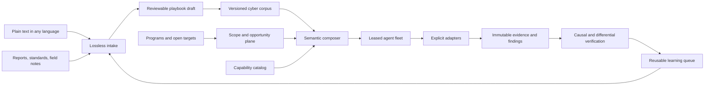

# White Hat Agent Core

**A model-neutral cyber capability brain for AI agents and human researchers.**

White Hat Agent Core turns community knowledge, exact program scope, adapter capabilities, evidence, and agent fleets
into one composable application layer. It is designed so a researcher can describe a technique in any language while
an AI-native team can use the same corpus through MCP, JSON Schema, Python, or the `wha` CLI.

The long-term goal is an open cyber corpus whose small, verified methods become more valuable as models improve: a
model can search, compose, execute through declared adapters, preserve negative results, verify causality, and return
new learning for review.

> **Status: foundation alpha.** The schemas, knowledge compiler, composition engine, scope evaluator, opportunity
> ranking, SQLite fleet leases, evidence store, adaptive discovery kernel, MCP server, and fixtures are implemented.
> This repository does not yet ship autonomous Internet discovery or scanner adapters. Live capability belongs in
> explicit adapters and exact program scope, not hidden inside the planner.

## The system



### What is first-class

- **Knowledge:** strict, versioned YAML playbooks with original language, provenance, rights, prerequisites, typed
  artifacts, capabilities, evidence requirements, failure modes, cleanup, and validation records.
- **Composition:** deterministic chaining by semantic `consumes`/`provides` contracts, objective fit, target kind,
  platform, execution ceiling, capability inventory, conflicts, and explicit compatibility.
- **Capabilities:** provider-neutral adapter contracts. The built-in catalog currently defines 18 capabilities used by
  the initial cross-domain, web, mobile, and binary playbooks.
- **Opportunities:** normalized public programs, open-source work, labs, and private engagements ranked by scope
  confidence, freshness, corpus coverage, capability fit, and operator priority.
- **Campaigns and fleet:** deterministic multi-target planning, exact scope and playbook-contract snapshots, budgets,
  atomic task deduplication, compatible-agent matching, expiring hashed leases, bounded retries, and explicit
  lifecycle state.
- **Evidence:** bounded local import, SHA-256 content addressing, provenance, sensitivity/redaction state, campaign/task
  binding, and findings that cannot claim verified status without registered evidence.
- **Discovery:** a resumable evidence graph, diverse hypothesis portfolio, progress-sensitive replanning, exact
  negative-result memory, adjacent-finding preservation, and causal proof tiers.
- **Interfaces:** namespaced FastMCP 3 tools/resources/prompts, JSON Schema, Python, and a nested CLI.

## Five-minute local start

Requirements: Python 3.12+ and [uv](https://docs.astral.sh/uv/).

```bash
git clone https://github.com/kappa9999/white-hat-agent.git
cd white-hat-agent
uv sync --locked --extra dev
uv run wha init .
uv run wha doctor --workspace .
uv run wha corpus search "http differential" --workspace .
uv run wha capability gaps \
  --workspace . \
  --playbook http-response-surface-map \
  --available http.request \
  --available http.capture
```

A new installation copies the bundled starter corpus and capability catalog into an ordinary workspace; both remain
editable and reviewable.

## Contribute knowledge without learning the schema

Write the method as you know it:

```bash
uv run wha knowledge ingest \
  --workspace . \
  --file examples/submissions/spanish-mobile-technique.md \
  --language es \
  --rights original-contribution \
  --playbook-yaml /tmp/mobile-draft.yaml
```

The compiler preserves the exact source, segments likely steps, adds original-language fields, and lists unresolved
questions. It does **not** pretend a translation or draft is validated. A host model can use the MCP
`knowledge_compile_submission` prompt to refine the same source against the public Playbook schema.

See [CONTRIBUTING.md](CONTRIBUTING.md) and [playbook authoring](docs/playbook-authoring.md).

## Compose a workflow

```bash
uv run wha playbook compose \
  --workspace . \
  --request examples/composition/web-to-verified.yaml
```

The example chains HTTP differential mapping into causal verification only when all semantic inputs and adapter
capabilities exist. If it cannot reach the desired artifact, the result names the missing frontier instead of
inventing a step.

Turn exact scope, targets, desired artifacts, and installed adapter capabilities into a staged campaign blueprint:

```bash
uv run wha campaign plan \
  --workspace . \
  --request examples/campaigns/planning-request.yaml
```

Every generated stage includes the concrete playbook version, semantic inputs/outputs, dependencies, typed probe
intent, and a decision bound to the exact scope and intent digests. An incomplete or out-of-scope plan returns
blockers as data; it is never silently made executable.

## Run a scoped fleet fixture

```bash
uv run wha scope check \
  --scope examples/campaigns/lab-scope.yaml \
  --intent examples/campaigns/http-intent.yaml

uv run wha campaign create \
  --workspace . \
  --manifest examples/campaigns/lab-campaign.yaml
uv run wha campaign enqueue \
  --workspace . \
  example-lab-campaign \
  --intent examples/campaigns/http-intent.yaml
uv run wha fleet register \
  --workspace . \
  --registration examples/agents/http-agent.yaml
uv run wha campaign state --workspace . example-lab-campaign ready
uv run wha campaign state --workspace . example-lab-campaign running
uv run wha fleet claim --workspace . example-http-agent
```

The example uses reserved `.test` targets and performs no network operation. A claimed task is an instruction for an
external adapter/agent, not an implicit scanner call.

## Use it from any MCP client

Start stdio:

```bash
uv run wha serve --workspace . --transport stdio
```

Or stateless Streamable HTTP:

```bash
uv run wha serve --workspace . --transport http --host 127.0.0.1 --port 8000
# endpoint: http://127.0.0.1:8000/mcp
```

The server mounts bounded namespaces:

| Namespace | Examples |
|---|---|
| `knowledge_*` | search, validate, intake, compose, learning candidates |
| `capability_*` | search contracts, inspect definitions, calculate gaps |
| `opportunity_*` | add, rank, triage, track |
| `campaign_*` | plan, scope-check, create, transition, enqueue |
| `fleet_*` | register, claim, heartbeat, report, stats |
| `evidence_*` | import, register, list, bind findings |
| `discovery_*` | plan, observe, causally verify |

See [MCP integration](docs/mcp.md) and [the architecture](docs/architecture.md).

## Corpus trust model

The corpus may represent any cyber technique. Trust is earned per version:

`draft → proposed → reviewed → validated → deprecated`

Original text, technical validity, authorship, rights, target authorization, execution side effects, and disclosure
status are separate facts. Untrusted submissions are data, never hidden shell instructions. Promotion requires strict
schema validation and evidence appropriate to the claim. Draft/proposed material remains searchable and reviewable,
but default composition and every persisted campaign require reviewed or validated playbook versions.

## Development

```bash
uv run ruff format --check .
uv run ruff check .
uv run pytest
uv run wha corpus validate --workspace .
uv run wha capability validate --workspace .
uv run python scripts/check_builtin_assets.py
uv run python scripts/export_schemas.py
uv build
```

## Project and security

- [Roadmap](ROADMAP.md)
- [Threat model](THREAT_MODEL.md)
- [Governance](GOVERNANCE.md)
- [Security reporting](SECURITY.md)
- [Contributing](CONTRIBUTING.md)

**Name note:** “White Hat Agent Core” is a working project name. A similarly named, unrelated agent-sandboxing project
already exists; complete the naming and trademark check in the [publication checklist](docs/publication-checklist.md)
before announcement.

Licensed under [Apache-2.0](LICENSE). The sole-maintainer foundation model is described in
[MAINTAINERS.md](MAINTAINERS.md).
