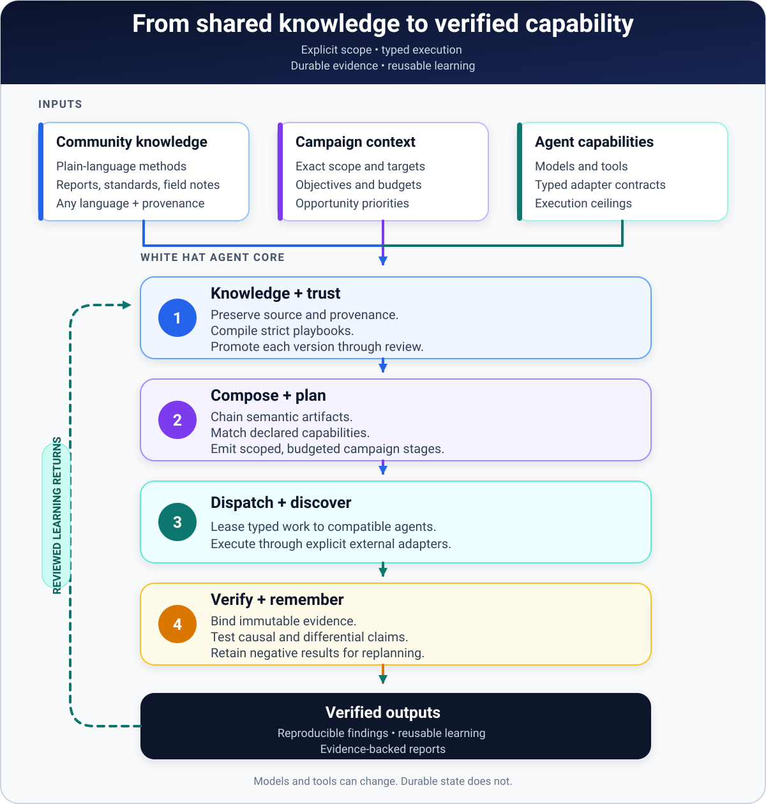

<div align="center">

# White Hat Agent Core

**A model-neutral cyber capability brain for AI agents and human researchers.**

[](https://github.com/kappa9999/white-hat-agent/actions/workflows/ci.yml)
[](https://github.com/kappa9999/white-hat-agent/actions/workflows/installers.yml)
[](https://www.python.org/)
[](LICENSE)
[](#project-status)

Turn community knowledge, exact program scope, adapter capabilities, evidence, and agent fleets into one composable
application layer—available through MCP, JSON Schema, Python, or the `wha` CLI.

</div>

## Install or update in one command

### macOS, Linux, and WSL

```bash
curl -LsSf https://raw.githubusercontent.com/kappa9999/white-hat-agent/main/install.sh | sh
```

### Windows PowerShell

```powershell
irm https://raw.githubusercontent.com/kappa9999/white-hat-agent/main/install.ps1 | iex
```

Run the same command again whenever you want to update. The installer is idempotent: it finds or installs
[`uv`](https://docs.astral.sh/uv/), provisions an isolated Python 3.12 runtime, refreshes White Hat Agent from GitHub,
and places `wha` on the user tool path. It does not require administrator privileges or modify an existing project.

Prefer to inspect remote scripts before running them? Read [install.sh](install.sh) or [install.ps1](install.ps1), then
follow the audited and source-install options in the [installation guide](docs/installation.md).

## Start in 60 seconds

```bash
wha init white-hat-workspace
cd white-hat-workspace
wha doctor
wha corpus search "http differential"
```

`wha init` creates an ordinary, portable workspace containing the starter corpus, capability catalog, configuration,
and local state database. Re-running it is safe and never overwrites existing corpus or capability files.

Connect the installed CLI to any stdio MCP client:

```json
{
  "mcpServers": {
    "white-hat-agent": {
      "command": "wha",
      "args": [
        "serve",
        "--workspace",
        "/absolute/path/to/white-hat-workspace",
        "--transport",
        "stdio"
      ]
    }
  }
}
```

See [MCP integration](docs/mcp.md) for Streamable HTTP, PATH troubleshooting, and client-neutral configuration.

## How it works

[](docs/architecture.md)

<p align="center"><sub>Click the diagram for the detailed architecture and trust boundaries.</sub></p>

| Layer | What it contributes |
|---|---|
| **Knowledge** | Lossless multilingual intake, provenance, strict playbooks, review state, and versioned validation |
| **Composition** | Deterministic chaining through semantic artifacts, capabilities, compatibility, and explicit blockers |
| **Campaigns** | Exact scope snapshots, target identity, budgets, typed probe intent, and playbook contracts |
| **Fleet** | Compatible-agent matching, atomic task deduplication, expiring leases, and bounded retries |
| **Evidence** | SHA-256 content addressing, provenance, finding revisions, and causal/differential verification |
| **Discovery** | Diverse hypotheses, progress-sensitive replanning, negative-result memory, and reusable learning |

Models, tools, and adapter providers remain replaceable. Exact target identity, scope, evidence provenance, and
replayable state remain durable.

## Contribute knowledge without learning a schema

Write the method in your own language and let the intake boundary preserve it:

```bash
wha knowledge ingest \
  --file my-technique.md \
  --language es \
  --rights original-contribution \
  --playbook-yaml draft-playbook.yaml
```

The compiler keeps the exact source, segments likely steps, and lists unresolved questions. A generated file is a
**draft**, not a claim that the method has been validated. Contributors can submit plain-language knowledge through
the [Knowledge contribution issue form](https://github.com/kappa9999/white-hat-agent/issues/new?template=knowledge.yml)
without knowing Python, MCP, AI prompting, or the playbook schema.

See [CONTRIBUTING.md](CONTRIBUTING.md), [knowledge intake](docs/knowledge-intake.md), and
[playbook authoring](docs/playbook-authoring.md).

## Compose and plan

The repository includes reproducible examples for composition, scope evaluation, campaign planning, fleet leasing,
evidence binding, and discovery replay:

```bash
git clone https://github.com/kappa9999/white-hat-agent.git
cd white-hat-agent
uv sync --locked --extra dev

uv run wha playbook compose \
  --workspace . \
  --request examples/composition/web-to-verified.yaml

uv run wha campaign plan \
  --workspace . \
  --request examples/campaigns/planning-request.yaml
```

An incomplete or out-of-scope plan returns machine-readable blockers. It is never silently made executable. The
bundled fixtures use reserved `.test` targets and perform no network operation.

## Interfaces

- **CLI:** nested `wha` commands for workspace, corpus, capabilities, scope, campaign, fleet, evidence, and discovery
- **MCP:** 37 bounded, namespaced tools plus resources and prompts over stdio or stateless Streamable HTTP
- **Python:** typed models and deterministic planning/composition primitives
- **JSON Schema:** generated public contracts for every durable interchange object

Start a local Streamable HTTP server when a client needs it:

```bash
wha serve --workspace /absolute/path/to/white-hat-workspace --transport http --host 127.0.0.1 --port 8000
# endpoint: http://127.0.0.1:8000/mcp
```

## Project status

> **Foundation alpha:** the knowledge compiler, composition engine, scope evaluator, opportunity ranking, SQLite
> fleet, evidence store, adaptive discovery kernel, MCP server, schemas, and deterministic fixtures are implemented.
> The repository does not yet ship autonomous Internet discovery or scanner adapters. Live capability belongs in
> explicit adapters with exact campaign scope, not hidden inside the planner.

Corpus trust is earned per version:

`draft → proposed → reviewed → validated → deprecated`

Original text, technical validity, authorship, rights, target authorization, execution side effects, and disclosure
status are separate facts. Untrusted submissions are data, never executable instructions.

## Development

```bash
uv sync --locked --extra dev
uv run ruff format --check .
uv run ruff check .
uv run pytest
uv run wha corpus validate --workspace .
uv run wha capability validate --workspace .
uv run python scripts/check_builtin_assets.py
uv run python scripts/export_schemas.py
uv build
```

## Project links

- [Architecture](docs/architecture.md)
- [Installation and updates](docs/installation.md)
- [MCP integration](docs/mcp.md)
- [Roadmap](ROADMAP.md)
- [Threat model](THREAT_MODEL.md)
- [Governance](GOVERNANCE.md)
- [Security reporting](SECURITY.md)
- [Contributing](CONTRIBUTING.md)

**Name note:** “White Hat Agent Core” is a working project name. A similarly named, unrelated agent-sandboxing project
already exists; complete the naming and trademark check in the [publication checklist](docs/publication-checklist.md)
before a coordinated launch.

Licensed under [Apache-2.0](LICENSE). The sole-maintainer foundation model is described in
[MAINTAINERS.md](MAINTAINERS.md).
