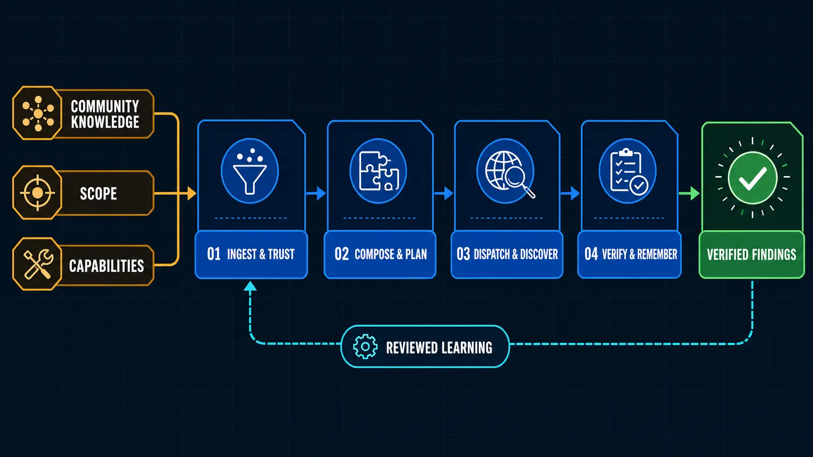

<div align="center">

# White Hat Agent Core

**A model-neutral cyber capability brain for AI agents and human researchers.**

[](https://github.com/kappa9999/white-hat-agent/actions/workflows/ci.yml)
[](https://github.com/kappa9999/white-hat-agent/actions/workflows/installers.yml)
[](https://github.com/kappa9999/white-hat-agent/actions/workflows/intelligence.yml)
[](https://www.python.org/)
[](LICENSE)
[](#project-status)

Turn community knowledge, exact program scope, adapter capabilities, evidence, and agent fleets into one composable
application layer—available through MCP, JSON Schema, Python, or the `wha` CLI.

</div>

## Install or update in one command

### macOS, Linux, and WSL

```bash
curl -LsSf https://raw.githubusercontent.com/kappa9999/white-hat-agent/main/install.sh | sh
```

### Windows PowerShell

```powershell
irm https://raw.githubusercontent.com/kappa9999/white-hat-agent/main/install.ps1 | iex
```

Run the same command again whenever you want to update. The installer is idempotent: it finds or installs
[`uv`](https://docs.astral.sh/uv/), provisions an isolated Python 3.12 runtime, refreshes White Hat Agent from GitHub,
and places `wha` on the user tool path. It does not require administrator privileges or modify an existing project.

Prefer to inspect remote scripts before running them? Read [install.sh](install.sh) or [install.ps1](install.ps1), then
follow the audited and source-install options in the [installation guide](docs/installation.md).

## Start in 60 seconds

```bash
wha init white-hat-workspace
cd white-hat-workspace
wha doctor
wha corpus search "http differential"
wha adapter list reverse
wha adapter status ghidra
```

`wha init` creates an ordinary, portable workspace containing the starter corpus, capability and adapter catalogs,
configuration, and local state. Re-running it is safe and never overwrites existing public catalog files.

Connect the installed CLI to any stdio MCP client:

```json
{
  "mcpServers": {
    "white-hat-agent": {
      "command": "wha",
      "args": [
        "serve",
        "--workspace",
        "/absolute/path/to/white-hat-workspace",
        "--transport",
        "stdio"
      ]
    }
  }
}
```

See [MCP integration](docs/mcp.md) for Streamable HTTP, PATH troubleshooting, and client-neutral configuration.

## Give an agent the tools it needs

White Hat Agent maps concrete tools and knowledge sources to the existing provider-neutral capability vocabulary. It
prefers healthy tools already on the host and never installs as a side effect of search, planning, or fleet work.

```bash
# Resolve the smallest provider set and expose any install/conformance gap.
wha adapter resolve --kind tool \
  --capability artifact.inspect --capability binary.behavior-identify

# Inspect the exact official release and SHA-256 without changing the host.
wha adapter plan ghidra --out ghidra-plan.json

# Explicit one-command install/update into this workspace when needed.
wha adapter install ghidra --yes

# Prove one exact operation before agents can claim its capability.
# Fixed command-backed version checks run only here, inside the offline sandbox.
wha adapter conform ghidra
wha adapter status ghidra

# Add and query exact, revision-bound machine-readable knowledge on demand.
wha adapter install mitre-attack --yes
wha adapter search mitre-attack T1059.001
```

The initial nonredundant tool set covers Ghidra, Frida, LLVM, YARA-X, TShark, capa, and JADX. Ghidra binary summaries,
capa behavior identification, and LLVM object inspection are executable through reviewed typed drivers on Linux/WSL.
They run without network access over immutable fleet-task evidence. Status and resolution never execute discovered
binaries; fixed command-backed version checks run only during explicit sandboxed conformance, and a version result
alone grants no executable capability. Knowledge adapters cover MITRE ATT&CK STIX and capa rules; CVE List V5, NVD
2.0, CISA KEV, OSV, and EPSS ingestion remains in the intelligence layer. See
[tools and knowledge adapters](docs/adapters.md).

Start the production public-intelligence loop with bounded official sources:

```bash
wha intelligence sync \
  --source cisa-kev --source osv \
  --since-hours 48 --limit-per-source 1000 --enrich-epss --require-success
wha intelligence sync \
  --source cve-list-v5 \
  --since-hours 6 --limit-per-source 5000 --require-success
wha intelligence sync \
  --source nvd \
  --since-hours 6 --limit-per-source 5000 --require-success
wha intelligence brief --source osv --source cve-list-v5 --source nvd --limit 25
```

Every selected upstream record is backed by an immutable raw snapshot and transparent priority factors. Intelligence
collection does not interact with affected targets; it produces evidence-backed leads for local or explicitly scoped
investigation. See the [production loop](docs/production-loop.md).

## How it works

The diagram focuses on the campaign and discovery execution path; public intelligence feeds opportunity selection
before the scope gate.

[](docs/assets/system-flow.webp)

| Layer | What it contributes |
|---|---|
| **Knowledge** | Lossless multilingual intake, provenance, strict playbooks, review state, and versioned validation |
| **Composition** | Deterministic chaining through semantic artifacts, capabilities, compatibility, and explicit blockers |
| **Adapters** | Observed identity, conformance-proven typed execution, digest-bound provisioning, and revision-bound knowledge |
| **Intelligence** | Bounded official-source ingestion, immutable snapshots, transparent priority, and exact-artifact applicability |
| **Campaigns** | Exact scope snapshots, target identity, budgets, typed probe intent, and playbook contracts |
| **Fleet** | Compatible-agent matching, atomic task deduplication, expiring leases, and bounded retries |
| **Evidence** | SHA-256 content addressing, provenance, finding revisions, and causal/differential verification |
| **Discovery** | Diverse hypotheses, progress-sensitive replanning, negative-result memory, and reusable learning |

Models, tools, and adapter providers remain replaceable. Exact target identity, scope, evidence provenance, and
replayable state remain durable.

## Contribute knowledge without learning a schema

Write the method in your own language and let the intake boundary preserve it:

```bash
wha knowledge ingest \
  --file my-technique.md \
  --language es \
  --rights original-contribution \
  --playbook-yaml draft-playbook.yaml
```

The compiler keeps the exact source, segments likely steps, and lists unresolved questions. A generated file is a
**draft**, not a claim that the method has been validated. Contributors can submit plain-language knowledge through
the [Knowledge contribution issue form](https://github.com/kappa9999/white-hat-agent/issues/new?template=knowledge.yml)
without knowing Python, MCP, AI prompting, or the playbook schema.

See [CONTRIBUTING.md](CONTRIBUTING.md), [knowledge intake](docs/knowledge-intake.md), and
[playbook authoring](docs/playbook-authoring.md).

## Compose and plan

The repository includes reproducible examples for composition, scope evaluation, campaign planning, fleet leasing,
evidence binding, and discovery replay:

```bash
git clone https://github.com/kappa9999/white-hat-agent.git
cd white-hat-agent
uv sync --locked --extra dev

uv run wha playbook compose \
  --workspace . \
  --request examples/composition/web-to-verified.yaml

uv run wha campaign plan \
  --workspace . \
  --request examples/campaigns/planning-request.yaml
```

An incomplete or out-of-scope plan returns machine-readable blockers. It is never silently made executable. The
bundled fixtures use reserved `.test` targets and perform no network operation.

## Interfaces

- **CLI:** nested `wha` commands for workspace, intelligence, corpus, capabilities, adapters, scope, campaign, fleet,
  evidence, and discovery
- **MCP:** bounded, namespaced tools plus resources and prompts over stdio or stateless Streamable HTTP
- **Python:** typed models and deterministic planning/composition primitives
- **JSON Schema:** generated public contracts for every durable interchange object

Start a local Streamable HTTP server when a client needs it:

```bash
wha serve --workspace /absolute/path/to/white-hat-workspace --transport http --host 127.0.0.1 --port 8000
# endpoint: http://127.0.0.1:8000/mcp
```

## Project status

> **Alpha:** the knowledge compiler, composition engine, public vulnerability-intelligence monitor, scope evaluator,
> opportunity ranking, concrete adapter registry/provisioning and typed offline execution, SQLite fleet, evidence store, adaptive discovery kernel,
> MCP server, schemas, and deterministic fixtures are implemented. Network access is limited to fixed public
> intelligence sources and explicit official adapter upstreams. The repository does not ship a general target scanner;
> live target capability belongs in explicit adapters with exact campaign scope, not hidden inside the planner.

Corpus trust is earned per version:

`draft → proposed → reviewed → validated → deprecated`

Original text, technical validity, authorship, rights, target authorization, execution side effects, and disclosure
status are separate facts. Untrusted submissions are data, never executable instructions.

## Development

```bash
uv sync --locked --extra dev
uv run ruff format --check .
uv run ruff check .
uv run pytest
uv run wha corpus validate --workspace .
uv run wha capability validate --workspace .
uv run python scripts/check_builtin_assets.py
uv run python scripts/export_schemas.py
uv build
```

## Project links

- [Architecture](docs/architecture.md)
- [Installation and updates](docs/installation.md)
- [MCP integration](docs/mcp.md)
- [Tools and knowledge adapters](docs/adapters.md)
- [Production intelligence and research loop](docs/production-loop.md)
- [Release provenance and recovery](docs/releases.md)
- [Changelog](CHANGELOG.md)
- [Roadmap](ROADMAP.md)
- [Threat model](THREAT_MODEL.md)
- [Governance](GOVERNANCE.md)
- [Security reporting](SECURITY.md)
- [Contributing](CONTRIBUTING.md)
- [Maintainers](MAINTAINERS.md)

Licensed under [Apache-2.0](LICENSE).
