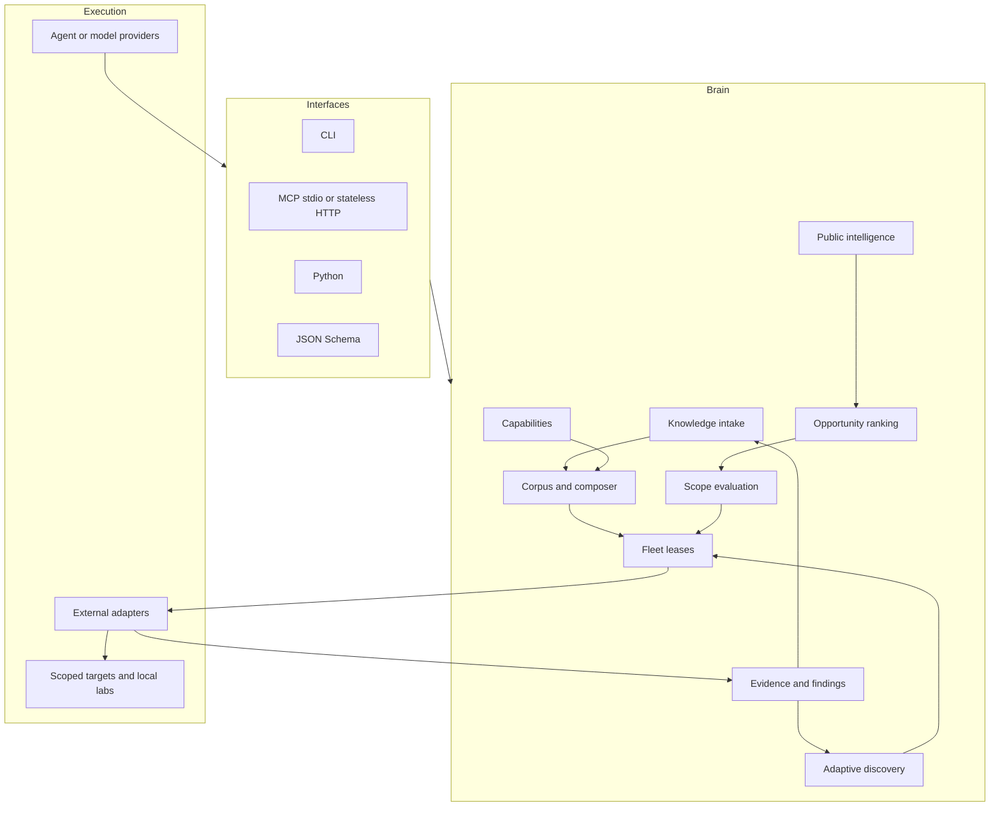

# Architecture

## Design thesis

The reusable advantage in autonomous cyber research is the harness around a model: exact state, broad but typed
knowledge, specialized tools, independent hypotheses, negative memory, evidence-driven replanning, and causal proof.
White Hat Agent Core owns those durable invariants while models and tools remain replaceable.

Effective discovery repeatedly changes representation, data source, and tool strategy as evidence accumulates. The
useful abstraction is therefore not a fixed checklist. It is a graph of facts, artifacts, authority transitions,
hypotheses, experiments, and evidence that can be resumed and recomposed.

## Layers



### Workspace

`whitehat.toml` resolves every mutable path relative to one workspace root. Escaping paths are rejected. A workspace
contains an editable corpus and capability catalog plus ignored state:

```text
corpus/playbooks/             reviewed public knowledge
capabilities/catalog.yaml    provider-neutral adapter contracts
.whitehat/submissions/       untrusted intake drafts
.whitehat/artifacts/         content-addressed evidence blobs
.whitehat/intelligence/      source snapshots and production reports
.whitehat/state/whitehat.db  intelligence, opportunity, campaign, fleet, evidence, finding state
schemas/                     generated public contracts
```

Bundled starter assets seed a new workspace but never overwrite an existing file.

### Public intelligence

The production intelligence boundary uses fixed official endpoints, explicit response/time/item limits, overlapping
incremental windows, and content-addressed raw snapshots. Normalized advisories retain source-native identity,
aliases, timestamps, status, affected ranges, references, source URI, and attribution. CVE is an optional alias, not
the database key. Records from CISA KEV and OSV remain independently attributable even when they describe the same
vulnerability; FIRST EPSS is a dated prioritization signal, not proof of exploitation.

Ranking is deterministic and inspectable. Confirmed KEV exploitation dominates probabilistic EPSS, while recency,
severity, applicability, and evidence completeness refine the queue. Collection never converts an advisory into an
executable target. The ordinary scope and campaign gates still apply before an adapter can interact with anything
beyond the public feed itself. See [production-loop.md](production-loop.md).

### Knowledge and composition

`KnowledgeSubmission` is the lossless boundary. It retains original text, language, source references, contributor,
rights declaration, and timestamp. The heuristic compiler segments likely steps and marks unresolved semantics. A
host model may refine the draft through a public MCP prompt, but strict models reject unknown fields and unsupported
claims remain explicit.

A playbook exposes:

- exact metadata and lifecycle state;
- target/platform/technology applicability;
- execution and scope requirements;
- typed inputs/outputs and semantic `consumes`/`provides` artifacts;
- an acyclic dependency graph of steps;
- provider-neutral capability IDs;
- success, failure, evidence, side-effect, cleanup, and timeout contracts;
- taxonomy/source provenance; and
- concrete validation records.

The composer performs a deterministic greedy search over latest versions. Eligibility gates target kind, platform,
execution ceiling, capabilities, input artifacts, and conflicts. Scoring rewards desired and novel artifacts,
objective/domain/technology overlap, and explicit compatibility. An incomplete result returns unresolved artifact
types—the machine-readable frontier for the next contribution.

### Capabilities and adapters

The catalog explains each capability's execution class, semantic inputs/outputs, side effects, and observable adapter
contract. It is not a list of installed tools. Agents register what their actual adapters can do; tasks are leased only
when requirements are a subset of that inventory and the agent's execution ceiling is sufficient.

The core intentionally does not translate `http.request` or `binary.diff` into a hidden shell command. Concrete
adapters own authentication, process isolation, protocol details, tool versions, timeouts, target checks, raw output,
and cleanup. This keeps the brain model-neutral and makes adapter claims auditable.

### Opportunities, scope, and campaigns

Opportunity records are discovery leads, not authorization. Ranking uses capability coverage, corpus coverage, scope
capture, explicit automation permission, freshness, and operator priority. A lead becomes executable only through a
`ScopeManifest` and `CampaignManifest`.

Scope evaluation applies validity windows, exact inclusion/exclusion precedence, domain/URL/IP/CIDR/repository
matching, execution classes, capability/action prohibitions, request bounds, and concurrency. Every decision embeds
the SHA-256 digest of the exact scope and intent. The fleet re-evaluates scope itself at enqueue time instead of
trusting a caller-supplied “allowed” boolean.

Search and intake expose every lifecycle state, but default composition admits only reviewed or validated versions.
Campaign creation enforces the same floor. Campaign planning snapshots each selected playbook's version, digest,
review state, required capabilities, minimum execution class,
action tags, side effects, and request floor. The fleet rejects an intent that changes identity or under-declares that
contract. Campaign state is explicit: new campaigns start in draft, draft/ready campaigns may collect work, and only
running campaigns lease it. The coordinator starts the wall-time clock on the first transition to running. Task and
cost budgets are enforced at enqueue. Task identities deduplicate equivalent intent/payload work. Leases are atomic
SQLite transactions; only a hash of each random token is stored, expiration requeues bounded attempts, and terminal
states clear lease material.

### Evidence and learning

Local evidence imports reject symlinks and oversized files, stream SHA-256, copy atomically into a content-addressed
path, and verify the copy. External evidence can be registered by immutable digest and URI. Every record carries
campaign/task, target, type, producer, time, provenance, sensitivity, and redaction state.

Supported or verified findings require registered evidence from the same campaign and compatible task. Task reports
may emit `reusable_learning`; those values enter a candidate queue. Conversion to corpus intake requires an explicit
rights declaration and preserves the result summary, exact structured value, and evidence IDs. No result silently
promotes itself into trusted knowledge.

### Adaptive discovery kernel

The discovery engine provides:

- exact target/build and environment identities;
- an evidence and authority graph;
- multiple falsifiable hypothesis families;
- deterministic expected-value scoring;
- exact negative-result keys `(hypothesis, revision, probe digest)`;
- plateau detection that increases novelty and information gain;
- bounded model-backed hypothesis expansion;
- adjacent-finding preservation; and
- causal, differential, and regression-closure proof tiers.

Its goal function approximates:

```text
expected discovery value
  = impact + reachability + evidence strength + information gain
    + novelty + causal verifiability + transferability
    - cost - blast radius - redundancy - stale retries
```

## Protocol surface

FastMCP mounts small namespaced servers behind one root. Pydantic return types produce structured output schemas.
Response size is bounded, child errors are masked consistently, tool lists are paginated, and HTTP runs stateless at
`/mcp`. SSE is not used. See [mcp.md](mcp.md).

## Trust boundaries

The core assumes all of these can be wrong or hostile:

- community text, URLs, playbooks, translations, and pull requests;
- model output and self-reported agent capabilities;
- adapter output, errors, or truncated artifacts;
- program pages that drift after capture;
- task results and claimed causal mechanisms; and
- local paths supplied through MCP or CLI.

Strict schemas, digests, bounded imports, path confinement, exact scope, lease ownership, evidence binding, corpus
review states, and differential verification reduce those risks. They do not replace adapter sandboxing, secrets
management, program-specific judgment, or disclosure coordination. See [THREAT_MODEL.md](../THREAT_MODEL.md).

## Why these constraints improve capability

Exact scope and evidence are not a defensive-versus-offensive classifier. They prevent an autonomous fleet from
wasting cycles on the wrong target, stale rules, duplicate tasks, false positives, hidden alternate paths, or
non-reproducible output. This is the same execution discipline needed for credible bug bounties, exploit validation,
reverse engineering, incident forensics, and remediation testing.
