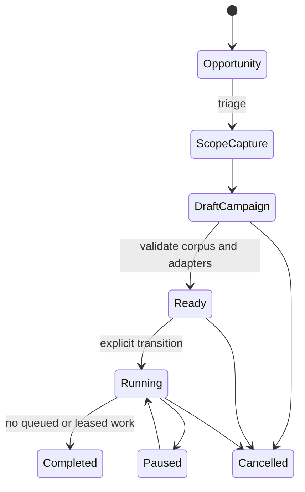

# Opportunity, campaign, and fleet lifecycle

## Opportunity is not scope

An opportunity is a lead with a source and freshness. Ranking favors explicit automation permission and a captured
scope digest, but even a high score grants no execution. Create a `ScopeManifest` from the exact current rules and a
`CampaignManifest` that binds that scope to a corpus manifest digest and budget.

## Plan

`CampaignPlanningRequest` joins the captured scope, one or more exact targets, the campaign objective, available
adapter capabilities, execution ceiling, and budget. The deterministic planner composes playbooks by semantic
artifacts for each target, turns them into dependency-ordered stages, evaluates every proposed intent against scope,
and returns a draft manifest bound to the current corpus digest. Missing artifacts, capabilities, or permissions are
explicit blockers. Planning does not persist or execute anything.

## Enqueue

`ProbeIntent` declares target kind/value, exact playbook version and digest, execution class, adapter capabilities,
action tags, request count, concurrency, side effects, cost, and scope ID. The fleet compares these claims with the
immutable playbook contract captured by the campaign, then computes its own `ScopeDecision`. The decision binds the
exact intent and scope digests. Under-declared or rejected work is never persisted.

Capability allowlists are deny-by-default, including an empty list. A scope that intentionally delegates capability
selection must set `allow_unlisted_capabilities: true`; explicit prohibitions still win.

## Lease

Agents register a capability inventory and maximum execution class. Only a running campaign can lease. Claiming uses
an immediate SQLite transaction ordered by priority and creation time. The returned token is shown once; only its
SHA-256 hash is stored. Heartbeats and results require the owner, token, and unexpired lease.

The wall-time budget begins at the coordinator-recorded first transition to `running`, not at an author-supplied
manifest timestamp. Pausing does not reset that deadline. Enqueue and claim both enforce the same stored deadline.

Expired leases return to the queue until the campaign's attempt limit is reached. Completing a campaign while queued
or leased work remains is rejected.

## Result and learning

A result separates summary, evidence identities, findings, adjacent hypotheses, and reusable learning. MCP/CLI result
submission checks registered evidence against the task's campaign. Learning is queued for review; it does not mutate
the corpus.
