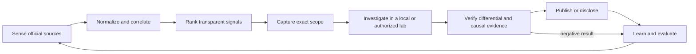

# Production intelligence and research loop

White Hat Agent is operated as an evidence-producing research system, not as an unbounded scanner. The first
production slice continuously collects public vulnerability intelligence, preserves exact source material, ranks
work, and hands selected records to scoped local or explicitly authorized investigations.

## Goal function

The long-running objective is to maximize durable public-security value:

```text
research value
  = verified novelty + expected impact + reproducibility
    + transferability + information gain + negative-result reuse
    - compute cost - reviewer cost - duplicate work - blast radius
```

The score is subordinate to hard invariants. A high-value idea is ineligible when target identity or authorization is
ambiguous, evidence provenance is missing, the proposed action exceeds the captured scope, or publication would
violate a disclosure or source-rights obligation. Public advisories are leads, not authorization to interact with a
deployed target.

This objective is measured over completed, reproducible outcomes rather than tool calls, findings claimed, or raw
scan volume. A strong negative result can be valuable when it closes a hypothesis and prevents repeated work.

## Operating cycle



1. **Sense:** fetch only fixed, documented public sources with bounded requests. Preserve response identity, retrieval
   time, content type, ETag/Last-Modified when supplied, digest, attribution, and the exact raw bytes used.
2. **Normalize:** retain source-native records. Correlate CVE, GHSA, OSV, PYSEC, and ecosystem identities as aliases;
   never erase one provider's provenance by collapsing it into another provider's record.
3. **Rank:** combine confirmed exploitation, dated probability signals, recency, severity, applicability, and evidence
   completeness. Store the factors and reasons alongside the score. CISA KEV confirmation outranks a low EPSS
   forecast.
4. **Scope:** convert a lead into executable work only after exact target/build and authorization are captured in a
   `ScopeManifest`. Automation permission is never inferred from the existence of a CVE or a public repository.
5. **Investigate:** prefer source review, patch-differential analysis, deterministic fixtures, and locally built
   vulnerable/fixed versions. Any live adapter must enforce scope, rate, budget, cancellation, and evidence limits.
6. **Verify:** require exact identities, raw artifacts, controls, repeated observations, and causal/differential proof
   before escalating a claim. Preserve alternate findings and failed hypotheses.
7. **Publish:** public intelligence briefs may be generated automatically. Vulnerability claims and external patches
   must be deduplicated, reproducible, minimally disclosed, and sent through the affected project's policy.
8. **Learn:** promote reusable procedure only through the existing rights, review, and validation lifecycle. Compare
   later campaign outcomes so weak heuristics can be revised or retired.

## Initial source contract

| Source | Role | Initial cadence | State rule |
|---|---|---:|---|
| CISA Known Exploited Vulnerabilities | Confirmed exploitation | 6 hours | Snapshot and diff the complete catalog; `dateAdded` is not a cursor |
| OSV | Package, version, and Git-range applicability | 6 hours | Read the reverse-chronological modified index with an overlap window, then snapshot selected records |
| FIRST EPSS | Dated probability enrichment | With each selected CVE set | Preserve score date; never treat probability as proof of exploitation |
| CVE List V5 | Canonical CNA and ADP containers | Next adapter | Preserve CNA/ADP containers and rejected state |
| NVD 2.0 | CVSS, CWE, CPE, and reference enrichment | Next adapter; no more than every 2 hours | Closed overlapping last-modified windows and documented rate limits |

OSV aggregates records with different upstream licenses. Every snapshot and normalized record therefore retains its
own source URI and attribution metadata; the corpus license is never assumed to replace an upstream source license.
EPSS is enrichment-only: missing scores remain visible as a partial enrichment result but do not invalidate a
successful CISA/OSV primary-source checkpoint.

## Automation levels

| Level | Default automation | Required gate |
|---|---|---|
| Intelligence | Fetch, validate, correlate, score, brief | Fixed official endpoint, byte/item/time bounds, immutable snapshot |
| Triage | Select local patch-diff or fixture candidates | Exact repository/version identity and duplicate search |
| Investigation | Build and test vulnerable/fixed versions locally | Reproducible environment, timeout, resource budget, evidence manifest |
| Authorized live work | Execute a bounded adapter | Current scope digest, explicit automation permission, target/rate/budget match |
| Publication | Generate a draft report or patch | Causal evidence, redaction/disclosure check, project policy, no duplicate thread |

Remote multi-tenant MCP deployment is outside the first production slice. Until authentication, authorization,
tenant isolation, audit principals, and a secrets boundary exist, use stdio or bind Streamable HTTP to localhost.

## Service objectives and scorecard

The scheduled monitor is healthy when:

- every successful run emits a machine-readable sync report, bounded recent OSV advisory selection, Markdown brief,
  and raw content-addressed snapshots;
- the latest successful CISA/OSV run is no more than 12 hours old;
- repeated overlapping runs are idempotent and record source updates without duplicating advisories;
- malformed, oversized, or partial upstream data fails closed and is visible in the run report;
- every ranked item exposes its score factors, aliases, source timestamp, observed time, raw digest, and attribution;
- KEV items are never demoted below non-KEV items solely because EPSS is low or absent; and
- no network interaction with an advisory's affected target occurs during intelligence ingestion.

The project-level scorecard tracks feed freshness, source coverage, snapshot integrity, correlation accuracy,
evidence completeness, false-positive rate, cost per reproduced result, negative-result reuse, time to triage,
external contribution acceptance, and time to close or revise invalid claims.

## Professional collaboration loop

External interaction is selective. Before opening an issue, comment, or pull request:

1. read the repository's security and contribution policy;
2. search for an existing advisory, issue, pull request, or embargoed process;
3. reproduce the exact problem on an allowed local artifact and test the proposed change;
4. minimize the patch and separate confirmed evidence from inference;
5. use one appropriate channel and avoid repetitive status comments; and
6. record the outcome so accepted and rejected approaches improve later routing.

An external contribution is successful when it saves maintainers work and survives their tests—not when it merely
creates activity.

## Deployment and recovery

`.github/workflows/intelligence.yml` runs the read-only source collectors on a recurring schedule and through manual
dispatch. Each hosted run restores the latest successful state artifact when available, writes a unique report, and
uploads the report, brief, normalized records, and the exact snapshots referenced or first observed in that run. A
separate two-day state handoff carries the SQLite index and cumulative content-addressed store to the next run. This
keeps cursors, validators, alias history, and recovery durable without repeatedly retaining the full cumulative store
as long-lived evidence. Persistent workstation or self-hosted-runner workspaces use the same overlapping windows and
idempotent upserts directly.

For a workstation or self-hosted runner:

```bash
wha init white-hat-workspace
wha intelligence sync \
  --workspace white-hat-workspace \
  --source cisa-kev --source osv \
  --since-hours 48 --limit-per-source 1000 --enrich-epss --require-success \
  --out white-hat-workspace/.whitehat/intelligence/reports/sync.json
wha intelligence brief \
  --workspace white-hat-workspace \
  --limit 25 \
  --out white-hat-workspace/.whitehat/intelligence/reports/brief.md
```

`limit-per-source` is an OSV/EPSS fail-closed ceiling, not a request target; CISA always validates and diffs its
complete bounded catalog. The OSV reader stops at the closed-window boundary. If the ceiling is reached first, the
source reports `partial`, and `--require-success` prevents cursor advancement from being mistaken for a complete
production run.

If a run is interrupted, retain its snapshots but do not advance the source's successful-sync state. Re-run with an
overlapping window; content addressing and idempotent upserts make replay safe.
